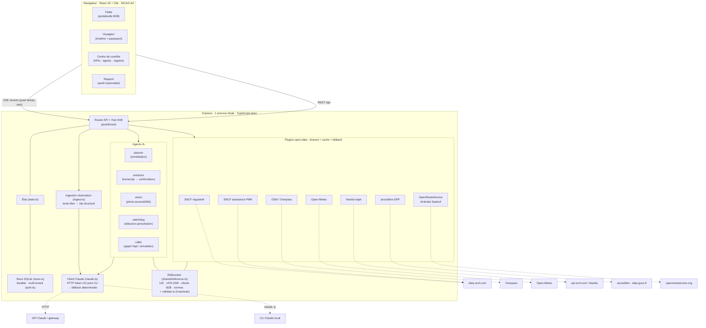

# TripAssist · Architecture technique

> La partie visible de l'iceberg pour un jury qui regarde sous le capot.
> Plateforme d'orchestration de voyage pilotée par IA pour les personnes en
> situation de handicap. Un seul process Node, temps réel de bout en bout,
> données réelles, et un principe : **ça ne casse jamais en démo, mais ça passe
> en réel dès qu'une clé est présente**.

## Vue d'ensemble



## Principe directeur : dégradation gracieuse

Chaque appel externe (IA ou donnée) suit le même contrat :

> **essai réel → timeout court → cache → fallback déterministe vérifié.**

Conséquence : la démo tourne **100 % hors-ligne, sans aucune clé**, avec des
données de référence réelles (badge gris « référence »). Dès qu'une clé est
fournie, la même source passe en **live** (badge vert), sans changer une ligne
d'UI. Le jury peut donc voir le système fonctionner en salle sans dépendre du
réseau, et vérifier qu'il est réellement branché.

## Front-end

- **React 18 + Vite + React Router**, TypeScript strict.
- Hydratation initiale par `GET /api/state`, puis flux **SSE unique** `/events`
  réduit par un reducer (`useEvents.ts`) : chaque événement (`step_updated`,
  `agent_log`, `transcript_chunk`, `ledger_entry`, `metrics`...) met à jour l'état.
- Quatre vues : Flotte (12 voyageurs, vue assureur/agence), Voyageur (timeline +
  passeport d'accessibilité), Centre de contrôle (KPIs, graphe d'agents, registre,
  appel IA, vision), Rapport imprimable.
- **Accessibilité comme produit** : contraste AA, navigation clavier complète,
  focus visible, `aria-live` sur les régions dynamiques, `prefers-reduced-motion`
  respecté. Thème clair/sombre persistant.

## Back-end

Un seul process Express sert : le flux SSE, l'API REST, et le front buildé.
**Persistance durable via SQLite** (`store.ts`, sur `node:sqlite` natif, zéro
dépendance), **multi-tenant** (`auth.ts` : chaque trip appartient à un opérateur,
assureur ou agence). L'état de démo reste reproductible (`/api/demo/reset` rejoue
l'état initial exact).

**Ingestion de réservation** (`ingest.ts`, `POST /api/ingest`) : le point d'entrée
du produit. Un texte de réservation libre est transformé en trip structuré (étapes,
dépendances, besoins d'accessibilité) par Claude, avec fallback déterministe, puis
stocké sous le tenant appelant. C'est ce qui déclenche l'orchestration proactive.

### Agents IA

| Agent       | Rôle                                                                 | IA réelle            | Fallback                 |
| ----------- | -------------------------------------------------------------------- | -------------------- | ------------------------ |
| `planner`   | Étapes à risque + plan de remédiation sans compromis d'accessibilité | Claude (HTTP/CLI)    | Plan codé par scénario   |
| `extractor` | Transcript d'appel → confirmation structurée                         | Claude (HTTP/CLI)    | Extraction par mots-clés |
| `vision`    | Photo d'un lieu → verdict d'accessibilité                            | Claude vision (HTTP) | Verdict de référence     |
| `watchdog`  | Détection de perturbation, cascade                                   | déterministe         | -                        |
| `caller`    | Appel téléphonique du prestataire                                    | Vapi (réel)          | Appel simulé scripté     |
| `trace`     | Journal de raisonnement des agents                                   | -                    | -                        |

**Client Claude (`claude.ts`)** : route vers l'API HTTP quand un token est présent
(`x-api-key` direct ou `Authorization: Bearer` pour un gateway type Capgemini),
**sinon** vers le **pont CLI** (`claude -p --output-format json`) quand
`ANTHROPIC_VIA_CLI=1`, **sinon** fallback déterministe. Les agents s'ouvrent sur
`claudeEnabled()` pour que le chemin réel soit réellement emprunté.

### Plugins open-data

Sept feeds de données réelles, six fournisseurs, un contrat commun
(timeout + cache + fallback) :

| Source                            | Fournisseur                  | État par défaut           |
| --------------------------------- | ---------------------------- | ------------------------- |
| Régularité axe Sud-Est            | data.sncf.com (Opendatasoft) | **LIVE**                  |
| Assistance gare PMR               | data.sncf.com                | **LIVE**                  |
| Lieux accessibles (Nice)          | OpenStreetMap / Overpass     | **LIVE**                  |
| Météo                             | Open-Meteo                   | **LIVE**                  |
| Trajet Paris→Nice temps réel      | Navitia (api.sncf.com)       | référence (token gratuit) |
| Accessibilité des ERP             | acceslibre · data.gouv.fr    | référence (token gratuit) |
| Itinéraire fauteuil sans escalier | OpenRouteService             | référence (clé gratuite)  |

### Référentiel + intégrité

`shared/reference.ts` est la source de vérité : codes **UIC** de gares réels,
codes **IATA SSR** (WCHC, WCLB, MAAS...), registre de clients B2B (assureurs /
agences), textes réglementaires (Loi 2005-102, Règlement UE 2021/782, IATA DGR,
EN 301 549 / WCAG 2.1 AA). `validate.ts` impose des invariants (ids uniques,
dépendances valides, pas de cycle, références cohérentes, alignement au
référentiel, format UIC), testés en continu.

## Qualité et rigueur

- **TypeScript strict** partout, front + back + code partagé (~6 500 lignes).
- **94 tests** (Vitest) : agents, plugins (avec fetch mocké), reducer SSE, machine
  d'état, store SQLite, ingestion, auth multi-tenant, validation d'intégrité, rendu.
- **ESLint** (flat config) + **Prettier**, **Lefthook** : pre-commit
  (format + lint sur le staged), pre-push (typecheck + tests). Rien de cassé ne part.
- **Un seul paquet racine** : le MVP (`server/ web/ shared/`). La landing page de
  démo vit sur la branche `concept`, pas ici.

## Réel vs démo (honnête pour le jury)

| Élément                                                 | Réel aujourd'hui       | Passe en réel avec                  |
| ------------------------------------------------------- | ---------------------- | ----------------------------------- |
| Régularité SNCF, assistance, OSM, météo                 | ✅ live                | -                                   |
| Raisonnement des agents (planner, extractor, ingestion) | ✅ vrai Claude via CLI | `ANTHROPIC_VIA_CLI=1` ou token HTTP |
| Persistance SQLite + multi-tenant                       | ✅ réel                | -                                   |
| Trajet Navitia, ERP acceslibre, itinéraire ORS          | référence vérifiée     | tokens gratuits                     |
| Appel téléphonique du prestataire                       | simulation scriptée    | compte Vapi + URL publique          |
| Référentiel (UIC/IATA/normes)                           | ✅ réel et vérifiable  | -                                   |

## Comment vérifier (sous le capot)

```bash
pnpm install
pnpm dev                 # Express (3000) + Vite (5173)
pnpm test                # 94 tests
pnpm typecheck           # TS strict, front + back

# données réelles en direct :
curl localhost:3000/api/context | jq   # SNCF/OSM/météo en live, sources tracées

# vrai Claude sans token HTTP :
ANTHROPIC_VIA_CLI=1 pnpm start
# puis POST /api/demo/chaos → plan de remédiation raisonné (pas le fallback)
```

Voir aussi : [`data-model.md`](data-model.md) (dictionnaire de données + référentiel)
et [`spec.md`](spec.md) (spécification d'origine, M1→M6).
